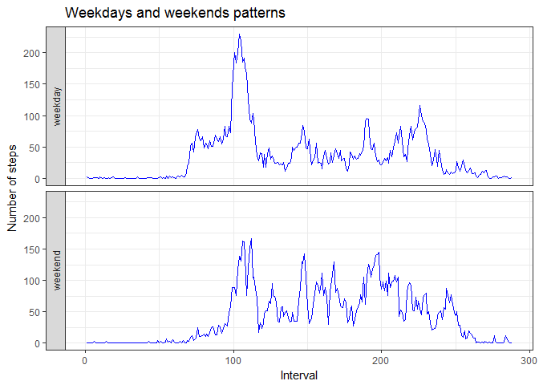

# Reproducible Research: Peer Assessment 1

 
## Loading and preprocessing the data

We use dplyr library for row data check after loading

```r
library(dplyr)
```

After data loading we detect dirty indexing of interval values and fix it by adding new column with better index. 

```r
data <- read.csv("activity.csv", stringsAsFactors = FALSE)
data$date <- as.POSIXct(data$date,format="%Y-%m-%d")
summary(data)
```

```
##      steps             date               interval     
##  Min.   :  0.00   Min.   :2012-10-01   Min.   :   0.0  
##  1st Qu.:  0.00   1st Qu.:2012-10-16   1st Qu.: 588.8  
##  Median :  0.00   Median :2012-10-31   Median :1177.5  
##  Mean   : 37.38   Mean   :2012-10-31   Mean   :1177.5  
##  3rd Qu.: 12.00   3rd Qu.:2012-11-15   3rd Qu.:1766.2  
##  Max.   :806.00   Max.   :2012-11-30   Max.   :2355.0  
##  NA's   :2304
```

```r
dim(data)
```

```
## [1] 17568     3
```

```r
by_date<-group_by(data, date)
intervals<-aggregate(interval ~ date, data, function(x) length(unique(x)))
summary(intervals)
```

```
##       date               interval  
##  Min.   :2012-10-01   Min.   :288  
##  1st Qu.:2012-10-16   1st Qu.:288  
##  Median :2012-10-31   Median :288  
##  Mean   :2012-10-31   Mean   :288  
##  3rd Qu.:2012-11-15   3rd Qu.:288  
##  Max.   :2012-11-30   Max.   :288
```

```r
dim(intervals)
```

```
## [1] 61  2
```
Intervals have exactly 288 unique values per day. But range of these values are misleading and needs fixing.

```r
# Each day includes 288 = 24*12 5 min long intervals. The problem is that numbers in the interval column have poor numeration: 2355 different values instead of 288.
# We add new interval_id column to fix this issue
data <- cbind(data, interval_id=rep(1:288,61))
```


## What is mean total number of steps taken per day?

To get the answer we use our data groupped bu date and summarize it by calculating sum of steps. 

```r
dayresults<-summarize(by_date, daily_step_sum=sum(steps, na.rm=TRUE))
with(dayresults, hist(daily_step_sum))
summary(dayresults)
```

```
##       date            daily_step_sum 
##  Min.   :2012-10-01   Min.   :    0  
##  1st Qu.:2012-10-16   1st Qu.: 6778  
##  Median :2012-10-31   Median :10395  
##  Mean   :2012-10-31   Mean   : 9354  
##  3rd Qu.:2012-11-15   3rd Qu.:12811  
##  Max.   :2012-11-30   Max.   :21194
```

```r
m<-mean(dayresults$daily_step_sum, na.rm = TRUE)
abline(v=m, col="blue")
```

<!-- -->

```r
median<-median(dayresults$daily_step_sum, na.rm = TRUE)
#mean
m
```

```
## [1] 9354.23
```

```r
#median
median
```

```
## [1] 10395
```

## What is the average daily activity pattern?


```r
by_interval_id <- group_by(data, interval_id)

intervalmeans<-summarize(by_interval_id, daily_interval_means=mean(steps, na.rm=TRUE))
summary(intervalmeans)
```

```
##   interval_id     daily_interval_means
##  Min.   :  1.00   Min.   :  0.000     
##  1st Qu.: 72.75   1st Qu.:  2.486     
##  Median :144.50   Median : 34.113     
##  Mean   :144.50   Mean   : 37.383     
##  3rd Qu.:216.25   3rd Qu.: 52.835     
##  Max.   :288.00   Max.   :206.170
```

```r
with(intervalmeans, plot(x=interval_id, y=daily_interval_means, type="l"))
title(main = "Average daily activity pattern")
```

<!-- -->

```r
interval_with_max_steps <- which.max(intervalmeans$daily_interval_means)
#number of interval_with_max_steps
intervalmeans$interval_id[interval_with_max_steps]
```

```
## [1] 104
```

```r
# maximum number of steps for average 5 min interval
intervalmeans$daily_interval_means[interval_with_max_steps]
```

```
## [1] 206.1698
```

We see that people who generated the data set were quite close to 10,000 steps goal. Good job!

## Imputing missing values

We apply daily activity pattern to impute missing steps values


```r
# investigate on NAs in steps

st<-table(is.na(data$steps))
st
```

```
## 
## FALSE  TRUE 
## 15264  2304
```

```r
# missing values in %%
as.numeric(st[2]/(st[1]+st[2]))
```

```
## [1] 0.1311475
```

```r
na_intervals <- is.na(data$steps)
summary(na_intervals)
```

```
##    Mode   FALSE    TRUE 
## logical   15264    2304
```

```r
# iputing NA step values with average for the intervals

data_imputed <- data

data_imputed$steps[na_intervals] <- rep(intervalmeans$daily_interval_means, 61)[na_intervals]

head(data_imputed)
```

```
##       steps       date interval interval_id
## 1 1.7169811 2012-10-01        0           1
## 2 0.3396226 2012-10-01        5           2
## 3 0.1320755 2012-10-01       10           3
## 4 0.1509434 2012-10-01       15           4
## 5 0.0754717 2012-10-01       20           5
## 6 2.0943396 2012-10-01       25           6
```

```r
#double check that we did not break non-NA values
table(data$steps==data_imputed$steps)
```

```
## 
##  TRUE 
## 15264
```

```r
by_date_imp<-group_by(data_imputed, date)
dayresults_imp<-summarize(by_date_imp, daily_step_sum=sum(steps, na.rm=TRUE))
with(dayresults_imp, hist(daily_step_sum))

summary(dayresults_imp)
```

```
##       date            daily_step_sum 
##  Min.   :2012-10-01   Min.   :   41  
##  1st Qu.:2012-10-16   1st Qu.: 9819  
##  Median :2012-10-31   Median :10766  
##  Mean   :2012-10-31   Mean   :10766  
##  3rd Qu.:2012-11-15   3rd Qu.:12811  
##  Max.   :2012-11-30   Max.   :21194
```

```r
m_imp <- mean(dayresults_imp$daily_step_sum, na.rm = TRUE)
abline(v=m_imp, col="blue")
```

<!-- -->

```r
median_imp <- median(dayresults_imp$daily_step_sum, na.rm = TRUE)
#mean
m_imp
```

```
## [1] 10766.19
```

```r
#median
median_imp
```

```
## [1] 10766.19
```

```r
# previous values
#mean
m
```

```
## [1] 9354.23
```

```r
#median
median
```

```
## [1] 10395
```
Imputing missed values really impacted data.  


## Are there differences in activity patterns between weekdays and weekends?

```r
data_imputed <- mutate(data_imputed, isweekend = weekdays(date, abbreviate =TRUE) %in% c("Sat", "Sun"))
data_imputed$isweekend <- as.factor(data_imputed$isweekend)
levels(data_imputed$isweekend) <- c("weekday", "weekend")
str(data_imputed)
```

```
## 'data.frame':	17568 obs. of  5 variables:
##  $ steps      : num  1.717 0.3396 0.1321 0.1509 0.0755 ...
##  $ date       : POSIXct, format: "2012-10-01" "2012-10-01" ...
##  $ interval   : int  0 5 10 15 20 25 30 35 40 45 ...
##  $ interval_id: int  1 2 3 4 5 6 7 8 9 10 ...
##  $ isweekend  : Factor w/ 2 levels "weekday","weekend": 1 1 1 1 1 1 1 1 1 1 ...
```

```r
by_date_isweekend <- group_by(data_imputed, isweekend, interval_id)

intervalmeans <- summarize(by_date_isweekend, daily_interval_means=mean(steps, na.rm=TRUE))
summary(intervalmeans)
```

```
##    isweekend    interval_id     daily_interval_means
##  weekday:288   Min.   :  1.00   Min.   :  0.000     
##  weekend:288   1st Qu.: 72.75   1st Qu.:  2.047     
##                Median :144.50   Median : 28.133     
##                Mean   :144.50   Mean   : 38.988     
##                3rd Qu.:216.25   3rd Qu.: 61.263     
##                Max.   :288.00   Max.   :230.378
```

```r
library(ggplot2)

g <- ggplot(intervalmeans, aes(x = interval_id, y = daily_interval_means))
g<-g+geom_line(colour = 'blue')+facet_grid(isweekend ~., switch = "both") +theme_bw()
g+labs(x="Interval", y="Number of steps", title="Weekdays and weekends patterns")
```

<!-- -->

Weekdays and weekends have different patterns for activity. For example, we see that people are  not so active in weekend mornings. They are more passive in working hours (probably because of looking into monitors instead of making steps).  
